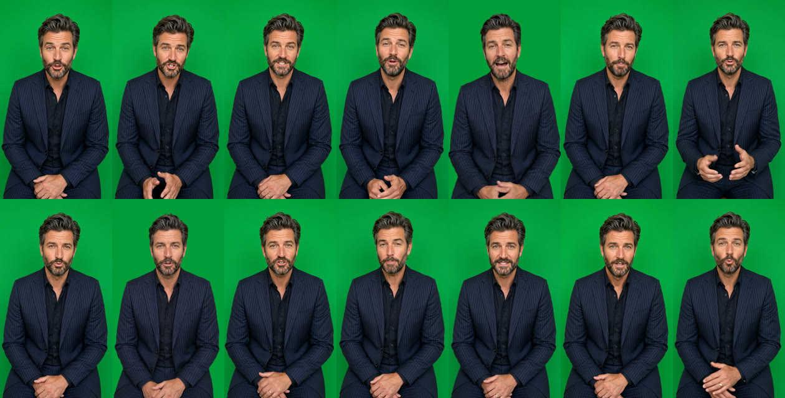

# Châteauneuf-du-Pape (anonymous producer) — green-screen presenter clips

These are individual green-screen clips for the editor; there's no B-roll and no assembled video. The presenter and voice are the same as in the Scaranto ad: the green-screen still from job `5878666a-29e4-4505-8e0c-ed0eb989d9e7`, and Callum (Higgsfield preset `858499d9-fef5-40e1-bc29-b4dc661dc283`).

Format: 720×1280 (9:16), 24 fps, H.264 with AAC 48 kHz stereo, on a flat chroma green (about RGB 2,157,57, `#029D39`). Every line is levelled to −16 LUFS. There's no music and no captions.



## Deliverables

- ZIP with every clip, tight and untrimmed, plus a README and contact sheet (60 MB): https://d2ol7oe51mr4n9.cloudfront.net/user_3IlTIleUqdksHUuNWaJnSBuISip/c33d53a8-9a81-4dec-9d21-aa5587fb7c68.zip
- The tight clips alone (29 MB) were sent directly in the session.

## Clips

Each version is one hook followed by B01–B10 in order. The body runs 77.1s, so each version lands at about 80–81s.

| Clip | Length | Section | Line (as spoken) |
|---|---|---|---|
| 01_H1 | 2.67s | Hook 1 | "I'm not allowed to tell you who made this wine." |
| 02_H2 | 4.08s | Hook 2 | "We discounted this wine so much, we had to sign an NDA." |
| 03_H3 | 4.00s | Hook 3 | "This wine is so discounted, the producer is anonymous." |
| 04_H4 | 3.75s | Hook 4 | "This wine's story will make you love the deal even more." |
| 05_B01 | 9.67s | Gap | "I can tell you where it's from, though. In the thirteen hundreds the Pope moved his court to Avignon, and the vineyards just up the river became the papal wine supply." |
| 06_B02 | 4.83s | Gap | "The village is still called Châteauneuf-du-Pape, the Pope's new castle." |
| 07_B03 | 10.00s | Stake + mechanism | "The vineyards look surprisingly like a dry riverbed. They're covered in galets roulés, round stones the Rhône left behind, which soak up the sun all day and keep the vines warm at night." |
| 08_B04 | 7.88s | Stake + mechanism | "Every grape is picked by hand, and the growers wrote their own quality rules in the nineteen-twenties, before France even had a national system." |
| 09_B05 | 7.75s | Revelation | "This one comes from a producer behind some of the region's best-known bottles. He bottled this to create a new staple of the appellation." |
| 10_B06 | 9.12s | Revelation | "But they made it for us on one condition: their name stays off the front. If you want to know who it is, you'll have to buy a bottle." |
| 11_B07 | 8.00s | Revelation | "It has an intense, typically Châteauneuf flavour of black fruit, spicy black pepper, wild herbs and an undertone of leather to finish." |
| 12_B08 | 10.00s | Payoff + proof | "It's a top one percent wine in the world. Jeb Dunnuck, who's spent years tasting just Rhône reds, gave it ninety-three. Jeff Leve and Vinous both have it above ninety as well." |
| 13_B09 | 4.21s | CTA | "It should be eighty pounds per bottle. On Winedrops it's just twenty." (changed from sixty on request) |
| 14_B10 | 5.62s | CTA | "But it's one of the region's best. This deal will end, so get it while you can." |

Changes from the brief:
- **Spoken numbers.** "1300s", "1920s", "1%", "93", "90" and "£" amounts are written out for speech.
- **Spelling.** "suprisingly" and "Wine-drops" are corrected to "surprisingly" and "Winedrops". Neither affects what he says.
- **Takes.** B02 and B06 were regenerated because the first takes repeated words. B01 and B05 came out on olive green and were re-keyed onto the same green as the rest.

## Flags for review

- **Length.** The script runs about 77s plus the hook, against the 44s in the brief. To get near 45s, it needs to lose roughly half its words.
- **Pronunciation.** Give these a listen: galets roulés (B03), Châteauneuf (B02, B07), and Jeb Dunnuck, Jeff Leve and Vinous (B08).
- **Hook 2 ("we had to sign an NDA").** This has to be literally true, or ASA could treat it as misleading.
- **"Top 1% wine in the world" and the scores.** These need a source: Dunnuck 93; Jeff Leve and Vinous 90+. Also, Dunnuck doesn't taste *only* Rhône reds; "who's spent years specialising in the Rhône" would be accurate.
- **"It should be £80 per bottle."** That's a reference price, so it needs substantiation (£20 is 75% off).
- **Pronouns in B05/B06.** The script switches from "He bottled this" to "they made it for us… their name". The clips follow the script as written.

## How it was made

Each line is one `gemini_omni` generation (9:16, 720p), checked against the script with faster-whisper and then revoiced to Callum with `voice_change`. The B01 and B05 re-greens use the narration workflow's `presenter_composite.sh` (fullframe over `#029D3A`; QC passed). The ZIP was built with:

```
CLIPS_ONLY=1 bash plan/greenscreen-package.sh plan/chateauneuf-anon-greenscreen-blocks.tsv chateauneuf_greenscreen_clips \
  "CHATEAUNEUF-DU-PAPE (ANONYMOUS PRODUCER) - GREEN-SCREEN PRESENTER CLIPS (for edit)" plan/chateauneuf-anon-greenscreen-notes.txt
```

[`chateauneuf-anon-greenscreen-blocks.tsv`](chateauneuf-anon-greenscreen-blocks.tsv) lists the voiced-clip URL, re-green URL and cut point for every clip. Drop `CLIPS_ONLY=1` to also build one assembled green-screen track per hook.
