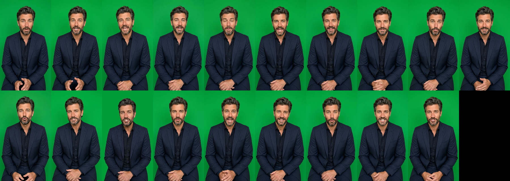

# Raptor & Crimson (Napa Cabernet) — green-screen presenter clips

These are individual green-screen clips for the editor; there's no B-roll and no assembled video. The presenter and voice are the same as in the Scaranto and Châteauneuf ads: the green-screen still from job `5878666a-29e4-4505-8e0c-ed0eb989d9e7`, and Callum (Higgsfield preset `858499d9-fef5-40e1-bc29-b4dc661dc283`, a British delivery).

Format: 720×1280 (9:16), 24 fps, H.264 with AAC 48 kHz stereo, on a flat chroma green (about RGB 2,157,57). Every line is levelled to −16 LUFS. There's no music and no captions.



## Deliverables

- ZIP with every clip, tight and untrimmed, plus a README and contact sheet (94 MB): https://d2ol7oe51mr4n9.cloudfront.net/user_3IlTIleUqdksHUuNWaJnSBuISip/23cadb7d-aead-4a21-9660-fdeb16e560c0.zip
- The tight clips alone were sent directly in the session as two zips (part 1: H1–H3, B00–B06; part 2: B07–B15).

## Clips and timing

Each version is one hook, then B00 ("Stick around…"), then B01–B15. At a natural pace the body runs 119.1s, so the versions land at 127.6s (H1), 124.0s (H2) and 124.8s (H3). That's in line with the 124s outline. The per-section times in the brief were off, so the split follows sentence boundaries rather than the stated windows.

| Clip | Length | Section | Line (as spoken) |
|---|---|---|---|
| 01_H1 | 8.50s | Hook 1 | "In nineteen seventy-six, nine French judges tasted wine blind and picked a California Cabernet over Bordeaux." |
| 02_H2 | 4.96s | Hook 2 | "By nineteen seventy-six, America had beaten France at growing their own grapes." |
| 03_H3 | 5.71s | Hook 3 | "After the Judgment of Paris, America became the best red wine grower in the world." |
| 04_B00 | 5.33s | Interrupt (after hook) | "Stick around and I'll tell you how you can get a bottle for over seventy percent off." |
| 05_B01 | 8.42s | Gap | "In nineteen seventy-six, at the Judgment of Paris, America produced a French-style wine, better than the French." |
| 06_B02 | 7.67s | Gap | "Nine French judges sat and drank Cabernet Sauvignon, held up the unmarked bottle, and called it the best in the world." |
| 07_B03 | 8.29s | Gap | "The winning red came from the Stags Leap District in Napa, and the story was so famous, the bottle ended up in the Smithsonian." |
| 08_B04 | 6.04s | Gap | "After that, Napa wasn't farm country any more. It was the most famous red wine name in America." |
| 09_B05 | 9.71s | Stake + mechanism | "Napa as a region is really small. The whole valley is a fraction of the size of Bordeaux, and that means prime vineyard land goes for half a million dollars an acre." |
| 10_B06 | 8.67s | Stake + mechanism | "Most of the county is protected from development, so it can't get any bigger. So Napa producers can afford to charge hundreds per bottle." |
| 11_B07 | 6.92s | Revelation | "Raptor and Crimson is made by Kevin Morrissey, who grew market standard wines at Etude and Ehlers Estate." |
| 12_B08 | 7.83s | Revelation | "He pulls Cabernet from Stags Leap District, Oakville, Atlas Peak and Diamond Mountain, where the best vines are found." |
| 13_B09 | 9.83s | Revelation | "He mixes this with more recent vines, to give some freshness to the blend, then ages it for eighteen months in American oak. And the result is stunning." |
| 14_B10 | 9.92s | Revelation | "You get this potent hit of blackcurrant, plum and espresso to start, before the taste mellows on the palate, fading to subtle dark chocolate and tobacco notes that sit long on the tongue." |
| 15_B11 | 8.62s | Payoff + proof | "And it shows. The Tasting Panel gave it ninety-six points, and Vivino drinkers put it in the top four percent of wines in the world." |
| 16_B12 | 4.42s | Payoff + proof | "This wine is so special, and it's a privilege to have a bottle." |
| 17_B13 | 5.50s | CTA | "And that's because it should be eighty-five dollars per bottle. But, do it the smart way." |
| 18_B14 | 5.58s | CTA | "Click below and the link will give you a case of six for just twenty dollars per bottle." |
| 19_B15 | 6.33s | CTA | "Now you can enjoy the very best of American heritage, for as much as a bottom shelf Costco." |

Changes from the brief:
- **Typos.** "who's grew" became "who grew", and "French style" became "French-style".
- **Spoken numbers.** "1976", "70%", "96", "$85", "6" and "$20" are written out for speech.
- **Retakes.** H1 and B01 were regenerated with more time because their last word was cut off. B13 took three attempts to get a take that didn't repeat words. B09 came out on olive green and was re-keyed onto the same green as the rest.

## Flags for review

- **US ad, British voice.** The presenter is kept the same as the UK ads, as asked. If it should sound American, Callum's voice would need swapping out.
- **Judgment of Paris details.**
  - There were eleven judges. Only the nine French judges' scores were counted, so "nine French judges" holds up.
  - The judges "held up the unmarked bottle and called it the best in the world" is dramatised. The 1973 Stag's Leap S.L.V. ranked first of the ten reds tasted.
  - The bottle in the Smithsonian is accurate.
- **Hook 3, "the best red wine grower in the world".** This is an unqualified superlative, and the most likely line to draw a challenge.
- **B07.** Verify Kevin Morrissey's history at Etude and Ehlers Estate. "Market standard wines" can read as "average wines"; "benchmark wines" may be what's meant.
- **B11.** The Tasting Panel 96 points and Vivino "top 4%" both need sources.
- **B13 ("it should be $85 per bottle").** That's a former-price claim, so it needs substantiation under the FTC pricing guides. $85 down to $20 is 76% off, which matches "over 70% off" in B00.
- **B15 ("for as much as a bottom shelf Costco").** The line reads as missing a word ("…a bottom-shelf Costco bottle"). Naming Costco in a price comparison is also worth a legal glance.

## How it was made

Each line is one `gemini_omni` generation (9:16, 720p). Each was checked with faster-whisper for wording, and with tail loudness for clipped endings, then revoiced to Callum with `voice_change`. B09 was re-greened with the narration workflow's `presenter_composite.sh` (QC passed). The ZIP was built with:

```
CLIPS_ONLY=1 bash plan/greenscreen-package.sh plan/raptor-crimson-greenscreen-blocks.tsv raptor_crimson_greenscreen_clips \
  "RAPTOR & CRIMSON (NAPA CABERNET) - GREEN-SCREEN PRESENTER CLIPS (for edit)" plan/raptor-crimson-greenscreen-notes.txt
```
