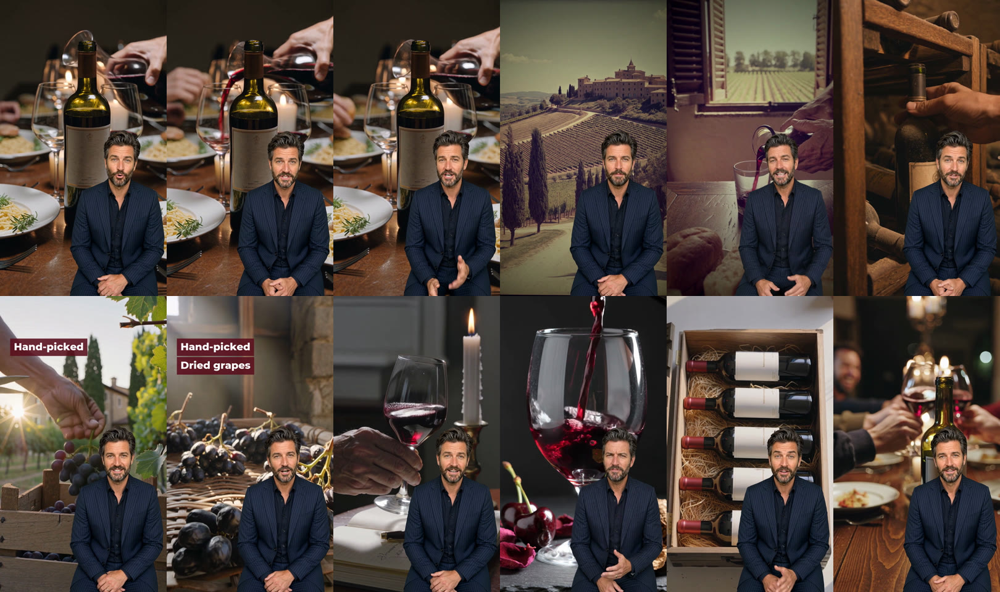

# Scaranto Governo — green-screen ad for Winedrops

Format: vertical 9:16 (1080×1920, 24 fps). The presenter from the seed photo is keyed off a green screen and sits bottom-right over full-frame B-roll, creator style. Three versions share one body and differ only in the opening hook.

Voice: Callum (Higgsfield preset `858499d9-fef5-40e1-bc29-b4dc661dc283`), applied to every clip so the voice is the same all the way through. No music bed.

Top row: hooks 1–3, B01–B03. Bottom row: B04–B09.

## Deliverables

| File | Length | Link |
|---|---|---|
| Hook 1 — "best story on any dinner table" | 72.7s | https://d2ol7oe51mr4n9.cloudfront.net/user_3IlTIleUqdksHUuNWaJnSBuISip/85258bab-cbc5-4125-8525-9cf26918869a.mp4 |
| Hook 2 — "99 and 100 points, but illegal in Italy" | 74.3s | https://d2ol7oe51mr4n9.cloudfront.net/user_3IlTIleUqdksHUuNWaJnSBuISip/fc33d356-1be5-4525-bf4b-baee22f0ee43.mp4 |
| Hook 3 — "a few Tuscan families broke the rules" | 73.5s | https://d2ol7oe51mr4n9.cloudfront.net/user_3IlTIleUqdksHUuNWaJnSBuISip/096704d8-51cf-4b02-ac06-ae446e91de41.mp4 |
| Everything as one ZIP (430 MB) | — | https://d2ol7oe51mr4n9.cloudfront.net/user_3IlTIleUqdksHUuNWaJnSBuISip/60f88d57-015c-44e8-a57f-78629c53be26.zip |
| Contact sheet | — | https://d2ol7oe51mr4n9.cloudfront.net/user_3IlTIleUqdksHUuNWaJnSBuISip/47693506-e87a-4eab-9d4b-e8644cefce35.jpg |

ZIP contents: the three final MP4s; `greenscreen/` (each voiced green-screen presenter clip trimmed to the cut, plus B01–B09 as one track); `broll/` (all 11 untrimmed B-roll clips); `reference/` (seed photo and the green-screen identity still); `README.txt`; `qc_report.txt`; `contact_sheet.jpg`.

## Timeline

The hook runs first (H1 3.7s, H2 5.3s or H3 4.6s), then the shared body. Body times are measured from the end of the hook.

| Block | Body start | Length | Script section | Line (as spoken) | B-roll | On-screen text |
|---|---|---|---|---|---|---|
| H1 | — | 3.7s | Interrupt | "This is the bottle with the best story on any dinner table." | Candlelit dinner table, blank-label bottle | — |
| H2 | — | 5.3s | Interrupt | "Two critics gave this ninety-nine and one hundred points, but the style was illegal in Italy." | same | — |
| H3 | — | 4.6s | Interrupt | "This wine exists because a few Tuscan families broke the rules." | same | — |
| B01 | 0.0s | 6.0s | Gap | "Back in the seventies, Chianti law told Tuscan winemakers exactly which grapes they could use." | Chianti hills, cypress road (70s film grade) | — |
| B02 | 6.0s | 6.7s | Gap | "A few families planted Merlot and Cabernet anyway, and had to sell what they made as plain table wine." | Carafe of table wine poured on farmhouse table (70s film grade) | — |
| B03 | 12.6s | 9.9s | Stake + mechanism | "Those table wines turned into Sassicaia and Tignanello. Collectors now pay well over fifty pounds a bottle for them, and the wine world gave them their own name: Super Tuscans." | Collector's cellar, bottle drawn from rack | — |
| B04 | 22.5s | 10.0s | Revelation | "Scaranto is Matteo Bernabei's project, made with his dad Franco, one of the best-known winemakers in Tuscany. They named this one Governo after an old Tuscan farmhouse trick." | Hand-picking Sangiovese, farmhouse behind | Hand-picked |
| B05 | 32.5s | 9.7s | Revelation | "Some of the grapes are left to dry, then go back into the wine, which makes it softer and rounder. After that it spends three months in French oak." | Grapes drying on racks, then French oak barrels (cut on "After") | + Dried grapes, + French oak |
| B06 | 42.2s | 5.8s | Payoff + proof | "Then the critics tasted it. Luca Maroni gave it ninety-nine. Cosimo Dell'Anna gave it a perfect one hundred." | Critic swirling a glass by candlelight | — |
| B07 | 48.0s | 6.8s | Payoff + proof | "In the glass you get black cherry, dried rose, a bit of tobacco, and a finish that keeps going." | Slow-mo pour with black cherries, dried rose, tobacco leaf | — |
| B08 | 54.8s | 8.0s | CTA | "And Winedrops will do a case of six for sixty-nine pounds ninety-nine, so under twelve pounds each. That's seventy percent off its normal price." | Wooden case of six blank-label bottles opened | — |
| B09 | 62.8s | 6.0s | CTA | "Get on the app, and tell people its story over a nice glass at dinner." | Dinner party clinking glasses | — |

## Changes from the brief

- **Length.** The brief allows 45s, but the voiceover runs about 69s at a natural pace, so each cut lands at 72–74s. Speech was not sped up. To reach 45s, the script needs to lose about 80 words. The Gap and Revelation sections are the longest.
- **[SOURCE].** The 100-point critic is filled in as **Cosimo Dell'Anna**. US retailer listings (Laithwaites group) credit him with 100 points for the **2020** vintage. Check both scores against the vintage Winedrops is actually selling before this runs. If it's wrong, only clips B06 and H2 need regenerating.
- **Script splits.** Each section was split at sentence boundaries so every talking clip stays under 10 seconds. No words were changed apart from spelling numbers out for speech: "£69.99" → "sixty-nine pounds ninety-nine", "70%" → "seventy percent".
- **On-screen text.** "Hand-picked / Dried grapes / French oak" builds up over B04–B05, timed to the B-roll and the word "After". No other text or captions were added.
- **Seed photo.** The man was taken out of the kitchen and the white-wine bottles (La Crema and others) were removed. He was regenerated waist-up on a green screen ([reference still](https://d8j0ntlcm91z4.cloudfront.net/user_3IlTIleUqdksHUuNWaJnSBuISip/hf_20261007_094818_5878666a-29e4-4505-8e0c-ed0eb989d9e7.png)), so no other brand's label appears in the ad.
- **Product shots.** No Scaranto packshot was supplied, so every bottle in the B-roll has a blank label. Drop a real packshot into the hook and CTA if you have one.

## Copy and compliance flags for review

- Hook 2's "the style was illegal in Italy" overstates the history. The style was never illegal. It just didn't qualify for Chianti DOC, so it had to be sold as *vino da tavola*. ASA could treat that as misleading; "the style broke Italian wine law" or "Italian wine law wouldn't allow it" says the same thing accurately.
- "70% off its normal price" needs a substantiated reference price (about £38.90 a bottle) before it runs in the UK.

## How it was made (Higgsfield)

- Green-screen identity still: `gpt_image_2` edit of the seed photo, job `5878666a-29e4-4505-8e0c-ed0eb989d9e7`.
- Talking clips: `gemini_omni`, 9:16 720p, one per block, then `voice_change` to Callum. B02 and B07 were regenerated once because the first takes had a tighter crop and a duller green.
- B-roll: `kling3_0` pro, 9:16 1080p, silent. The drying-grapes shot was regenerated once because the grapes looked like tomatoes.
- Assembly: [`scaranto-governo-build.sh`](scaranto-governo-build.sh), run in the Higgsfield sandbox. It measures each clip's speech end with faster-whisper and trims to it. Presenter keying uses the narration workflow's `presenter_composite.sh` (cutout, bottom-right, full frame width, 60% height); every block passed its key QC. The script also adds the on-screen text, cuts the three hook versions and packages the ZIP. It reads its upload URLs from `/home/user/urls.env`, which is not committed.

| Block | Voiced green-screen job | B-roll job |
|---|---|---|
| H1 | `2ab5ee83-318a-4840-8b47-9baa4303b8e0` | `9e99fae2-13d2-4e54-ac5c-02a13f1ff507` |
| H2 | `0feffe8a-3076-4bcd-8dcc-7514ff3005db` | (same) |
| H3 | `233ba7e4-a0fe-4b00-ab19-92f5a934d8d3` | (same) |
| B01 | `e1895c87-240e-402f-be4f-d873abcb7ee0` | `75eb2adb-344e-48da-8c65-77b30535eaad` |
| B02 | `f62f818f-b12a-46ca-a056-2309a0594bec` | `3ad6a41d-0616-49ae-becb-2915c9a69712` |
| B03 | `79bf447d-8e85-4c31-b6f1-d5ce3f6e59e7` | `865674ed-2697-4ca3-8878-ebfd44b0dd28` |
| B04 | `0c449be4-0b6e-4d19-afd4-d2181d99623f` | `50e8c388-c113-4727-a269-345350eb62d3` |
| B05 | `8924c62f-411b-488b-bdca-4213ffc4956b` | `43e3cd62-48b2-4288-ab35-f1f597088fe1` then `a3c4cbbc-f7a7-489d-9a00-28dce1c4b64f` |
| B06 | `4b53ced3-0bf1-43bd-acae-c9a7c9bacf7c` | `2402dbf5-343e-4f22-a85c-886189eef253` |
| B07 | `9680243c-977a-4972-8701-863ba7e7a6f1` | `bd1b794a-d78a-4399-be4b-f8a4482788ba` |
| B08 | `fce0af41-4e63-4d16-bb83-66f24b1d3594` | `57330cfe-6afa-4288-ad0b-36ce0caa38c7` |
| B09 | `48147e82-d2a8-4db4-92c3-ba2c8038f70a` | `5b3dfe06-2cad-4849-85a2-8a0bf997d3cc` |
