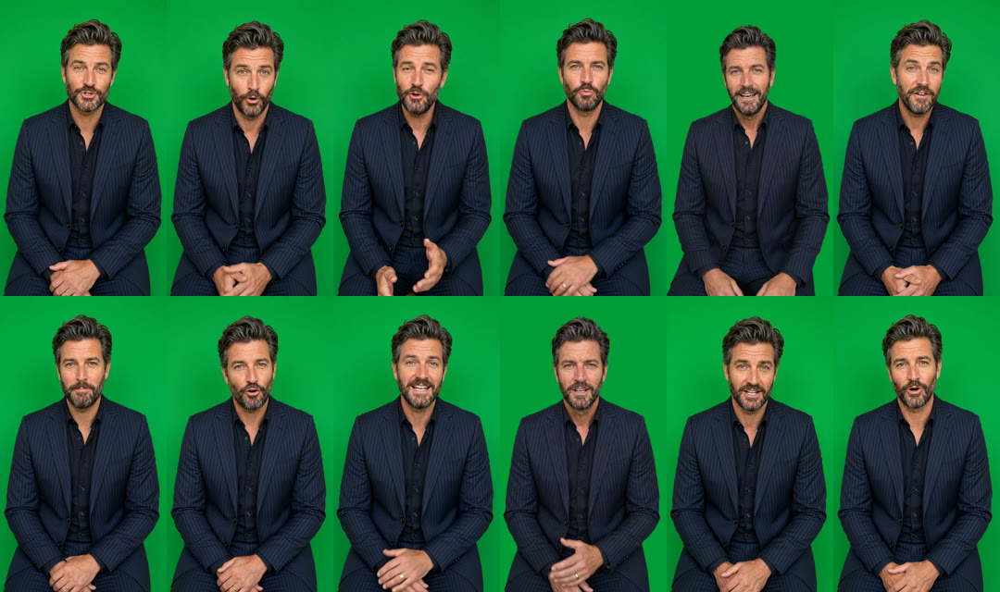

# Scaranto Governo — green-screen presenter for Winedrops

These are green-screen clips only. The editor keys the presenter and adds the B-roll.

The man from the seed photo talks to camera, waist-up, on a flat chroma green (about RGB 2,157,57, `#029D39`). The clips are vertical 9:16, 720×1280, 24 fps, H.264 with AAC 48 kHz stereo. The voice is Callum (Higgsfield preset `858499d9-fef5-40e1-bc29-b4dc661dc283`) on every line, and every line is levelled to −16 LUFS (peaks at −0.7 dBFS). There is no music and there are no captions.

Top row: H1, H2, H3, B01, B02, B03. Bottom row: B04–B09.

## Deliverables

> **B06 revised (7 Oct 2026).** B06 now credits **The Italian Wine Guy** with the perfect 100, in place of Cosimo Dell'Anna. The replacement clip `09_B06.mp4` (6.96s) was sent on its own. The ZIP below still holds the old B06, so swap in the new one. The timecodes on this page include the new B06; the original full-length versions run 1.12s shorter than shown.

| File | Length | Link |
|---|---|---|
| ZIP of everything (138 MB) | — | https://d2ol7oe51mr4n9.cloudfront.net/user_3IlTIleUqdksHUuNWaJnSBuISip/0e03b3aa-d0fa-4ab6-ac8a-80feecebd6eb.zip |

Inside the ZIP:

- `scaranto_greenscreen_hook1_best_story.mp4` (72.7s), `scaranto_greenscreen_hook2_critics_illegal.mp4` (74.3s) and `scaranto_greenscreen_hook3_broke_the_rules.mp4` (73.5s). Each is one continuous green-screen track: the hook followed by the shared body.
- `lines/`: each of the 12 lines as its own clip, cut tight to the speech. The full versions are built from these.
- `lines_untrimmed/`: the same 12 lines with the full generated tail, a second or so of him holding a look, for handles.
- `reference/greenscreen_reference.png`: the still the clips were generated from.
- `README.txt`: timecodes for all three versions.
- `contact_sheet.jpg`.

## Timecodes

The hook comes first: H1 runs 3.75s, H2 5.33s and H3 4.58s. The body follows. Body times are measured from the end of the hook. Add the hook length to get the time in each version.

| Block | Body start | Length | Section | Line (as spoken) | On-screen text cue |
|---|---|---|---|---|---|
| H1 | — | 3.75s | Interrupt | "This is the bottle with the best story on any dinner table." | |
| H2 | — | 5.33s | Interrupt | "Two critics gave this ninety-nine and one hundred points, but the style was illegal in Italy." | |
| H3 | — | 4.58s | Interrupt | "This wine exists because a few Tuscan families broke the rules." | |
| B01 | 0.00s | 5.96s | Gap | "Back in the seventies, Chianti law told Tuscan winemakers exactly which grapes they could use." | |
| B02 | 5.96s | 6.71s | Gap | "A few families planted Merlot and Cabernet anyway, and had to sell what they made as plain table wine." | |
| B03 | 12.67s | 9.91s | Stake + mechanism | "Those table wines turned into Sassicaia and Tignanello. Collectors now pay well over fifty pounds a bottle for them, and the wine world gave them their own name: Super Tuscans." | |
| B04 | 22.58s | 10.00s | Revelation | "Scaranto is Matteo Bernabei's project, made with his dad Franco, one of the best-known winemakers in Tuscany. They named this one Governo after an old Tuscan farmhouse trick." | "Hand-picked" |
| B05 | 32.58s | 9.75s | Revelation | "Some of the grapes are left to dry, then go back into the wine, which makes it softer and rounder. After that it spends three months in French oak." | "Dried grapes"; "French oak" on "After that" (+6.75s) |
| B06 | 42.33s | 6.96s | Payoff + proof | "Then the critics tasted it. Luca Maroni gave it ninety-nine. The Italian Wine Guy gave it a perfect one hundred." | |
| B07 | 49.29s | 6.79s | Payoff + proof | "In the glass you get black cherry, dried rose, a bit of tobacco, and a finish that keeps going." | |
| B08 | 56.08s | 8.00s | CTA | "And Winedrops will do a case of six for sixty-nine pounds ninety-nine, so under twelve pounds each. That's seventy percent off its normal price." | |
| B09 | 64.08s | 6.00s | CTA | "Get on the app, and tell people its story over a nice glass at dinner." | |
| end | 70.08s | | | | |

## Notes for the edit

- **Jump cuts.** Every line is a separate generation, so his pose shifts slightly at each cut. Cover the cuts with B-roll or a punch-in.
- **Key.** All 12 lines share one green. B02 and B07 were generated on an olive green and were re-keyed onto the same green as the rest (same frames, QC-passed key), so one key setting covers the whole track. Their originals are listed below if needed.
- **Resolution.** The source model tops out at 720p. That's fine when he's keyed over B-roll at about half the frame height. Full-frame at 1080×1920 would need an upscale.
- **Length.** The brief allows 45s, but the voiceover runs about 69s at a natural pace, plus the hook. Speech was not sped up. To reach 45s, the script needs to lose about 80 words. The Gap and Revelation sections are the longest.

## Copy and compliance flags for review

- **[SOURCE].** The 100 points is now credited to **The Italian Wine Guy**, as requested. Have the published review to hand, and check both scores against the vintage Winedrops is selling. If either changes, only clips B06 and H2 need regenerating.
- **Hook 2.** "The style was illegal in Italy" overstates the history. The wines just didn't qualify for Chianti DOC, so they were sold as *vino da tavola*. ASA could treat that as misleading; "Italian wine law wouldn't allow it" says the same thing accurately.
- **"70% off its normal price."** This needs a substantiated reference price (about £38.90 a bottle) before it runs in the UK.
- **Spoken numbers.** Apart from writing prices and percentages out for speech ("£69.99" → "sixty-nine pounds ninety-nine", "70%" → "seventy percent"), the lines match the script word for word.

## How it was made (Higgsfield)

- **Green-screen identity still:** a `gpt_image_2` edit of the seed photo, job `5878666a-29e4-4505-8e0c-ed0eb989d9e7`. The kitchen, the table and the other brands' bottles were removed, and he was reframed waist-up on green.
- **Talking clips:** `gemini_omni`, 9:16 720p, one generation per line, then `voice_change` to Callum. Each clip was checked against the script with faster-whisper.
- **Package:** [`scaranto-governo-greenscreen-build.sh`](scaranto-governo-greenscreen-build.sh) rebuilds the ZIP from the job URLs below. Needs curl, ffmpeg, python3 and zip.

| Block | Voiced green-screen job | Note |
|---|---|---|
| H1 | `2ab5ee83-318a-4840-8b47-9baa4303b8e0` | |
| H2 | `0feffe8a-3076-4bcd-8dcc-7514ff3005db` | |
| H3 | `233ba7e4-a0fe-4b00-ab19-92f5a934d8d3` | |
| B01 | `e1895c87-240e-402f-be4f-d873abcb7ee0` | |
| B02 | `f62f818f-b12a-46ca-a056-2309a0594bec` | Re-greened video: upload `ee835294-95af-4bb5-a901-016c0fd57436` |
| B03 | `79bf447d-8e85-4c31-b6f1-d5ce3f6e59e7` | |
| B04 | `0c449be4-0b6e-4d19-afd4-d2181d99623f` | |
| B05 | `8924c62f-411b-488b-bdca-4213ffc4956b` | |
| B06 | `587999a4-f019-45e8-a12b-2fba2236885b` | Revised line (Italian Wine Guy) from generation `a1f38b64-3fa5-4461-ad48-2d07b547af84`. Replaces `4b53ced3` (Cosimo Dell'Anna). |
| B07 | `9680243c-977a-4972-8701-863ba7e7a6f1` | Re-greened video: upload `21a7e783-1c10-474a-81e3-afab8806be28` |
| B08 | `fce0af41-4e63-4d16-bb83-66f24b1d3594` | |
| B09 | `48147e82-d2a8-4db4-92c3-ba2c8038f70a` | |
