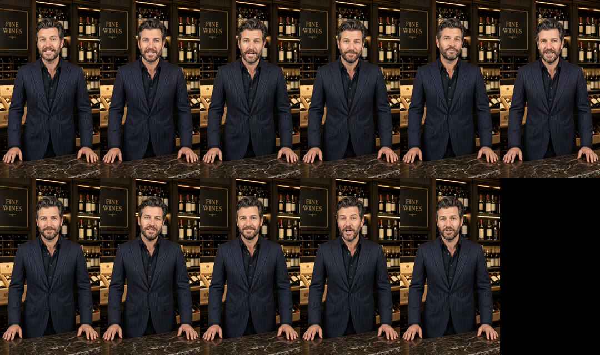

# Châteauneuf-du-Pape countdown — sommelier to-camera clips

These are individual to-camera clips for the editor. There's no B-roll, no countdown clock and no assembled video; the editors add all three. The sommelier is the man from the wine-shop seed photo: navy pinstripe suit, standing behind a marble counter with his hands on it, a FINE WINES sign behind him. The voice is Callum (Higgsfield preset `858499d9-fef5-40e1-bc29-b4dc661dc283`), as in the earlier Winedrops ads.

Every clip starts on the seed frame and holds the same locked-off shot. Nothing moves in the headroom above him, so the countdown clock can go there.

Format: 1080×1920 (9:16), 24 fps, H.264 with AAC 48 kHz stereo. Every clip is levelled to −16 LUFS (peaks at −1 dB). There's no music and there are no captions.

Top row: H1, H2, H3, B01, B02, B03. Bottom row: B04–B08.

## Deliverables

| File | Size | Link |
|---|---|---|
| ZIP of the 11 clips, README and contact sheet | 101 MB | https://d2ol7oe51mr4n9.cloudfront.net/user_3IlTIleUqdksHUuNWaJnSBuISip/3b185b0a-01d8-4e4f-af8a-c39b8d1dbaf0.zip |

## Clips

Each version is one hook followed by B01–B08 in order. The body runs 69.5s, so the versions come out at 74.3s (H1), 74.4s (H2) and 76.0s (H3).

| Clip | Length | Section | Line (as spoken) |
|---|---|---|---|
| 01_H1 | 4.79s | Hook 1 | "Before that timer runs out, I'm going to tell you about a wine that's got an NDA." |
| 02_H2 | 4.88s | Hook 2 | "There are only a few hundred bottles of this left, and the timer's already running." |
| 03_H3 | 6.50s | Hook 3 | "Seven hundred years ago this was the Pope's wine. You've got until that clock stops to try it." |
| 04_B01 | 8.79s | Gap | "In the thirteen hundreds the Pope moved his court to Avignon, and the vineyards up the river became the papal wine supply." |
| 05_B02 | 5.62s | Gap | "The village is still called Châteauneuf-du-Pape, the Pope's new castle." |
| 06_B03 | 9.25s | Stake | "The vineyards are covered in galets roulés, that act like pocket radiators, soaking up the sun all day and warming the vines at night." |
| 07_B04 | 9.62s | Stake | "That gives the grapes even juicier, and more vibrant flavours than anywhere else. And that means a full-bodied wine that is surprisingly light on the palate." |
| 08_B05 | 9.67s | Revelation | "There's these gorgeous strong notes of black fruit and black pepper. Underneath, there are some fresh wild herbs and a bit of leather to round out the flavour." |
| 09_B06 | 8.62s | Revelation | "That bold flavour is why Jeb Dunnuck gave it a ninety-three rating. Nearly flawless. By the way, that clock's still ticking." |
| 10_B07 | 7.92s | CTA | "Thing is, it should be eighty pounds per bottle. But on Winedrops, you can get six for less than the price of two." |
| 11_B08 | 10.00s | CTA | "A hundred and twenty-five pounds, with free delivery. But the deal won't last longer than this timer, so don't keep scrolling and miss out. Tap below." |

Changes from the script:

- **Spoken numbers.** Dates, scores and prices are written out as words so he says them naturally.
- **H2.** The generator's content filter blocked every take of the full sentence, including reworded ones. Each half passed on its own, so H2 is two generations joined after "left" with a 3-frame dissolve. The join sits in the pause, and both halves start from the seed frame, so his pose barely moves across it. The two halves had different low-frequency room hum, so both get a 120 Hz low-cut to keep the background even.
- **Takes.** The first H3 take repeated "stops to try it", so it was regenerated.

## Flags for review

- **The countdown clock.** H1, H3, B06 and B08 all tie the offer to the timer ("the deal won't last longer than this timer"). Under the DMCC Act 2024, falsely saying an offer is only available for a very limited time is a banned practice, and the CMA has named fake countdown timers specifically. The deal has to really end when the clock hits zero, and the clock can't restart for each viewer.
- **"Only a few hundred bottles of this left" (H2).** That's a stock claim. It has to be true whenever the ad is running.
- **"A wine that's got an NDA" (H1).** Nothing in the body pays this off: the anonymous-producer story from the earlier Châteauneuf script isn't in this one. Either add a line or treat H1 as the weakest hook. It also has to be literally true.
- **"More vibrant flavours than anywhere else" (B04).** That's an absolute comparison and would need substantiation. "Some of the most vibrant flavours in France" makes the same point safely.
- **"Jeb Dunnuck… ninety-three. Nearly flawless." (B06).** Check that the 93 is for this cuvée and vintage. "Nearly flawless" sits straight after his name, so it reads as his words; use it only if he wrote it.
- **"It should be eighty pounds per bottle" (B07).** That's a reference price, so it needs substantiation. The maths holds: six for £125 is £20.83 a bottle, and "less than the price of two" is true, since two would be £160.
- **Length.** The body runs about 69.5s plus the hook, against the 51s outline. Speech wasn't sped up. Getting to 51s means cutting roughly a quarter of the words; B03–B05 carry the most.
- **Presenter age.** He clearly reads as over 25, as CAP 18.16 requires for anyone playing a significant role in an alcohol ad.

## How it was made (Higgsfield)

- **Picture.** `gemini_omni_flash_1_1` image-to-video, with the seed photo (media `b3216c1a-9ef7-4fcd-9e1b-dcc7b096d1c2`) as the start image, at 9:16 1080p. There's one generation per line, and every prompt locks the camera and framing. Each take was checked against the script with faster-whisper, plus a last-frame strip against the seed.
- **Voice.** `voice_change` to Callum fails on this model's outputs and on its raw files. It works on a 720p proxy (H.264 High, AAC 44.1 kHz). The revoiced audio lines up with the original to within 10 ms (envelope correlation 0.92–0.98), so it's laid straight back onto the 1080p picture.
- **Package.** [`sommelier-countdown-build.sh`](sommelier-countdown-build.sh) rebuilds the ZIP from [`sommelier-countdown-blocks.tsv`](sommelier-countdown-blocks.tsv), which holds the generation URL, revoiced URL, cut point and line for every clip. Notes for the README are in [`sommelier-countdown-notes.txt`](sommelier-countdown-notes.txt). It needs curl, ffmpeg, python3 and zip.

| Clip | Picture job | Revoiced job |
|---|---|---|
| H1 | `f7d8a9df-df05-4583-b9f7-b632906703da` | `d1fdb19b-8276-4e86-b758-a5f7aeedde00` |
| H2 (first half) | `dbdd86b5-af35-4752-97b9-9df39c520e34` | `8efcb8fa-49ba-4b68-bea8-2612619a72e0` |
| H2 (second half) | `e5f975fe-00cf-4908-aa00-e6f192450e6c` | `67edac48-403a-429b-bcb4-62ea47fa3f53` |
| H3 | `8f05302c-16d1-409b-a154-18232d236633` | `a1320a44-8575-40d2-ac20-cd6b7991bbb0` |
| B01 | `3a27ae18-745d-4172-bdc9-152ca79fc156` | `def45691-9908-42c9-9e05-225ffb927c24` |
| B02 | `ce46a2ce-5bce-4e67-8440-404e0963013b` | `aaef6d57-5eb0-4efc-be92-c869ad873dbf` |
| B03 | `e3e91a9f-384a-4aa1-be80-f3b4b109b552` | `590f5905-a171-45cc-99d6-1a731b9e513e` |
| B04 | `c12e0732-47b8-42de-8f45-235bacc0c046` | `f15d07b0-4403-4daa-b992-cbb259e1a8b8` |
| B05 | `82fd80a7-b0d6-4973-90a0-8016f06621be` | `af4da0da-d02f-49f8-bc5f-08b00b49f06b` |
| B06 | `ecd5812e-950a-4d30-8e12-3449adb4d2b6` | `17b855da-b04e-4efd-87d1-1b2b949f3537` |
| B07 | `d05405f4-9df2-4c6a-80ba-69fb85079833` | `15a14038-ae05-410f-bd90-d4b281e49fc4` |
| B08 | `28e7c547-798f-491e-a27d-83483b3d92e2` | `452eae3c-3aa6-4e08-9420-9477136da320` |
